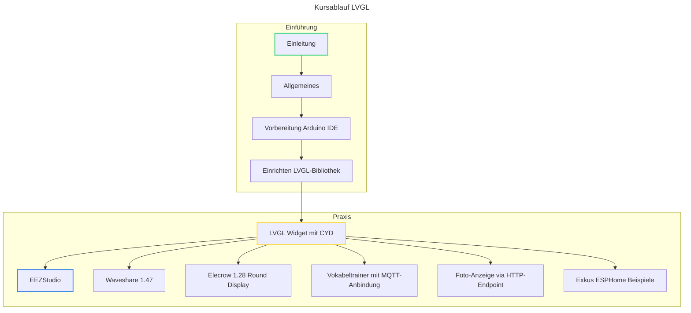

```mermaid
---
title: Kursablauf LVGL 
---
graph TB
    subgraph Einführung
    A[Einleitung] --> B1[Allgemeines]
    B1 --> B2[Vorbereitung Arduino IDE]
    B2 --> B3[Einrichten LVGL-Bibliothek]
    
    end

    subgraph Praxis 

    B3 --> B4[LVGL Widget mit CYD]
  
    B4 --> D[EEZStudio]
    B4 --> E[Waveshare 1.47]
    B4 --> F[Elecrow 1.28 Round Display]
    B4 --> G[Vokabeltrainer mit MQTT-Anbindung]
    B4 --> H[Foto-Anzeige via HTTP-Endpoint]
    B4 --> I[Exkus ESPHome Beispiele]

    end
     %% Styling für die verschiedenen Flows
    class A flow1;
    class B4 flow2
    class D flow3

    %% Definition der Klassen
    classDef flow1 stroke:#33d17a,stroke-width:2px;
    classDef flow2 stroke:#f9d94b,stroke-width:2px;
    classDef flow3 stroke:#3584e4,stroke-width:2px;

```
